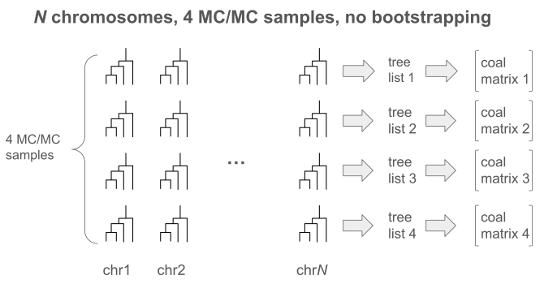
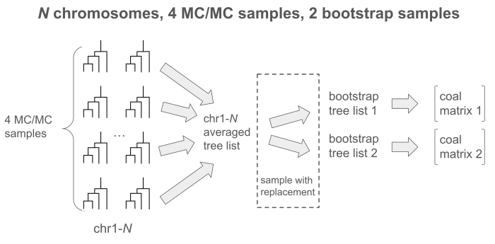

.. _concepts:

Concepts
========

.. note::
  The ``mrpast`` command line often processes multiple chromosomes at once. Some
  inputs, such as VCF files, recombination rate maps, and ancestral sequence
  files, can be specified as either one for all chromosomes (if they are
  identical) or one per chromosome. When you want to specify multiple files, you
  must provide the file *prefix* and ``mrpast`` will search for all files with that
  prefix matching the expected file extension. These files are then processed in
  sorted order (lexicographic) and are assumed to match up with the other files (ARGs,
  VCFs, etc) based on this order.

Data Filtering
--------------

When using real data, people often apply some filtering criteria to the genotypes. It is important to note that
overly aggressive filtering can have a negative impact on the construction of ARGs. ARGs rely on the density of
segregating sites (polymorphic sites that separate samples from each other based on the presence or absence of
certain alleles), and substantial changes to the number of segregating sites will have an impact on ``mrpast``.

Generally, you should filter your data so that there are no non-SNPs variants (indels, SVs, etc.). ``tsinfer`` supports
missing data, unknown ancestral state, and multi-allelic sites: though an excess of any of these may cause poor
results (because ``tsinfer`` does not use these when building the ARG, it just maps them to the ARG afterwards). Other
ARG inference methods do not support these features, so filtering will be needed to remove sites with missing
data (or imputation performed), unknown ancestral state, and restrict to bi-allelic sites.

Models
------

A mrpast input model specifies:

1. The ploidy of the individuals in the model.
2. The coalescence rate parameters for each deme (population).
3. The migration rate parameters between each pair of demes (populations).
4. The (optional) growth rate parameters for each deme (population).
5. The conversions from one population to another, e.g. "pop1 was created as a split from pop2 after epoch2" (also supports admixture of multiple source populations)
6. The (optional) names of each population.

More details about constructing and modifying models can be found `here <modeling.html>`_, and reading the heavily annotated
2-deme out-of-Africa model `here <https://github.com/aprilweilab/mrpast/blob/main/examples/ooa_2t12.yaml>`_ can also be informative.

Tree Sampling
-------------
From each ARG processed, only a subset of local trees is used for coalescence counting. The goal is for trees to be sampled
far enough apart on the genome that they can be thought of as somewhat independent. The ``mrpast process`` argument
``--tree-sample-rate`` defines how many base-pair to leave in between each tree that is sampled. The same tree is never
sampled twice. Additionally, the ``--rate-map-threshold`` argument can further reduce the number of trees sampled by
avoiding trees in low recombination rate regions.

Replication
-----------

The concept of replication is used in a couple different ways in mrpast.

Solver Replicates
~~~~~~~~~~~~~~~~~
A solver replicate is just a randomly-initialized instance of a concrete model that is fed to the maximum likelihood
solver. Because the solver may get stuck in local minima on the objective function for certain models, we run many
randomly initialized solver replicates and pick the one with the best likelihood.

Simulation Replicates
~~~~~~~~~~~~~~~~~~~~~
Simulation replicates are treated as "virtual chromosomes" in mrpast. By default we generate 20 of them via ``mrpast simulate``
and they are treated the same way that chromosomes are treated in real data: as all generated from the same model, but evolving
somewhat independently.

Coalescence Matrices
~~~~~~~~~~~~~~~~~~~~
ARGs are turned into coalescence matrices. Each coalescence matrix captures all of the sampled coalescences within all of
the chromosomes. So when using 20 simulation replicates and no bootstrapping you will have a single coalescence matrix that
represents all chromosomes. However, if you use ARG sampling and/or bootstrap sampling (see below), you will get more than one
coalescence matrix.

ARG Samples
~~~~~~~~~~~
Certain ARG inference methods support MC/MC to generate multiple ARGs that represent the same input data. For example, Relate supports
MC/MC of branch lengths (though the ARG topology is fixed), and SINGER supports MC/MC of both topology and branch lengths.
While simulated ARGs and tsinfer ARGs will only have a single ARG per "chromosome", these other methods can create multiple
ARGs per "chromosome".

When you have ``K`` sampled ARGs per ``N`` chromosomes, and no bootstrapping, you will have ``K`` coalescence matrices. One
for each of the ARGs sampled. When mrpast maximizes the likelihood, it will use the average of these ``K`` matrices to obtain
a result, but variational analyses (confidence intervals or model selection) will use the ``K`` matrices separately
to estimate this variation.

When you have ``B`` bootstrap samples, and ``K`` ARGs per ``N`` chromosomes, you will have ``B`` coalescence matrices. Prior to
bootstrapping, the ``K`` ARG samples will be merged so that the ``K`` trees from the same position on the same chromosome will
have their coalescence information merged, and these "merges trees" is what the bootsrapping will sample.

Bootstrap Samples
~~~~~~~~~~~~~~~~~
Bootstrapping just samples with replacement from the sampled local trees (or "merged trees") taken from the ARG. When bootstrapping
is enabled, it is the only source of variation (i.e., the coalescence matrices correspond one-to-one with bootstrap samples).
Bootstrapping is useful for computing confidence intervals and doing model selection.

Population Maps
---------------

Each dataset has ``N`` individuals that are mapped to ``P`` populations. The example models provided with mrpast expect input data
that has anywhere from 1 and 20 populations. Every population in the model that is "active" during the most recent time epoch needs
to have associated individuals in the dataset. The population map is a JSON file that maps the individuals in the dataset to the
populations in the model. The population names are provided in the population map, but it is the _order_ of populations between the
model and the map that associates them. The population map JSON looks like:

::

  {
    "mapping": [
      [ ... ],                       <-- list of individual indexes that are in the first population by model order
      [ ... ],                       <-- list of individual indexes that are in the second population by model order
      ... 
    ],
    "names": [
      "pop1",
      "pop2",
      ...
    ]
  }

The easiest way to understand the mapping between model and population map is to simulate a model via ``mrpast simulate`` and then
use ``mrpast sim2vcf`` to export the simulation. This latter step will create the ``*.popmap.json`` file for the corresponding
simulated ARGs and the model that generated them.

Time Discretization
-------------------

mrpast discretizes time into buckets in order to construct coalescence matrices. Models that have 2 or fewer epochs can usually just
use the default number of time slices (20). Models with more than 2 epochs, or with growth rates, should use more time slices. For example,
when analyzing the OutOfAfrica_3G09 model we use either ``--num-times 200`` or ``--num-times 50L``. The former is just 200 time slices by
assigning an approximately equal number of (panmictic) coalescences to each time slice. The latter is using 50 left-skewed time slices, which
can improve accuracy for tsinfer and simulated ARGs (because there is higher resolution for more recent time). However, the left-skewed time
slices do not work for all ARG inference methods, and Relate and SINGER often produce (obviously) poor results with left-skewed discretization.

Theoretical Methods (GIM)
-------------------------

There are two sources of variation that are useful in mrpast: bootstrapped samples, and MC/MC ARG samples (see above). The variation produced
by these sources can be used in one of two ways:

1. Directly, by measuring the sample standard deviation and then assuming normality and producing confidence intervals or plotting the variation.
2. Indirectly, by using the variation to compute the expectation of the gradient (the "J" matrix) which, in conjunction with other information, can be used to produce theoretical estimates of the standard deviation _and_ can be used to produce an adjusted Akaike Information Criterion for model selection.

These second, indirect methods, make use of the Godambe Information Matrix (GIM).

Polarization
-------------------------
All three ARG methods integrated with mrpast work best with polarized data. mrpast can do the polarization for you via
``mrpast polarize``. An ancestral FASTA sequence is required for performing polarization. The GRCh37 human ancestral sequence can be found via the
`relate documentation <https://myersgroup.github.io/relate/input_data.html#Data>`_, and GRCh38 human ancestral sequence can be found from
Ensembl `here <https://ftp.ensembl.org/pub/release-112/fasta/ancestral_alleles/>`_.