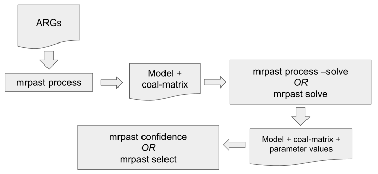

Bootstrapping
=============

To understand bootstrapping, you need to understand the flow of information between the later ``mrpast`` stages:

All of the commands in the above flow diagram have some interaction with bootstrapping. ``mrpast process``
produces the coalescence matrix from the input ARGs. When using ``mrpast process --bootstrap coalcounts``, there
is not one coalscence matrix created, but ``100`` matrices, each created by bootstrap-sampling (a subset of) the
local trees from the ARGs. However, creating these ``100`` bootstrapped matrices does not cause any bootstrapped
results to be created - it simply makes the data *available* for subsequent commands.

You can change the number of bootstrap matrices that are created via the ``mrpast process --bootstrap-iter <N>``
command.

.. note::

    Bootstrapping is not the only way to get multiple coalescence matrices. There is an experimental feature that
    lets you instead use the MC/MC samples from SINGER or Relate to create the multiple matrices (``mrpast process --bootstrap none``).
    In our experience, the MC/MC sampling produces less variation in the coalescence distribution than bootstrapping,
    possibly because ``mrpast`` uses so many trees along the genome.

Effect on parameter inference
-----------------------------

The maximum likelihood inference is performed on the coalescence matrix created by averaging all the matrices
created from bootstrapping trees. That is, inference is performed on a single matrix, and the parameter point
estimates come from this.

Generating bootstrapped results
-------------------------------

The primary use for bootstrapped matrices is parameter confidence intervals. When you run ``mrpast confidence``
it runs the maximum likelihood solver on each bootstrapped coalescence matrix, for ``R`` replicates each (to help
avoid getting stuck in local minima). For example:

::
    mrpast confidence -j 20 --replicates 20 --timeout 60 ooa3.output/ooa_3g09.simarg_ts200.solve_in.bootstrap.31.out.json

Uses ``20`` threads and ``R=20`` to generate two outputs (after running the solver :math:`20 \times 100 = 2000` times):

1. A ``.csv`` file that contains parameter estimates for every bootstrapped coalescence matrix. If there are ``100`` matrices (the default), there will be ``100`` sets of parameter values, each with a corresponding negative log-likelihood value. 

2. A ``.out/`` directory that contains ``2000`` JSON files, each containing the maximum likelihood estimate for a given replicate of a given bootstrapped coalescence matrix.

The ``.csv`` file can be used by ``mrpast show`` or the :py:meth:`mrpast.result.summarize_bootstrap_data` API to summarize the variation in the parameters across the bootstrap samples.

The ``.out/`` directory is discussed in the next section.

Comparing models
----------------

Models are compared with a variant of the AIC statistic. Whereas AIC just needs the number of model parameters plus the log-likelihood, the variant ``mrpast`` uses requires
the Godambe information matrix (GIM), which is computed by taking the derivatives of the objective function near the maximum likelihood estimate. As such, computing AIC
requires the coalescence matrix and the parameter estimates. While AIC can be computed for a single output (e.g., the point estimate that ``mrpast process --solve`` produces),
it is very much preferred to use many outputs, so that you are comparing *distributions* of AIC values between multiple models. In order to do this, generate the bootstrap
results as above, and then use ``mrpast select --bootstrap``, passing in the ``.json`` files that were used in ``mrpast confidence``, which will then find all the data in
the corresponding ``.out/`` directory and compute AIC for *all 100 bootstrap results*.